## Hi there 👋

<!--
**Thamimts/Thamimts** is a ✨ _special_ ✨ repository because its `README.md` (this file) appears on your GitHub profile.

Here are some ideas to get you started:

- 🔭 I’m currently working on ...
- 🌱 I’m currently learning ...
- 👯 I’m looking to collaborate on ...
- 🤔 I’m looking for help with ...
- 💬 Ask me about ...
- 📫 How to reach me: ...
- 😄 Pronouns: ...
- ⚡ Fun fact: ...
-->
<picture>
  <source media="(prefers-color-scheme: dark)" srcset="./dark(1).svg">
  <source media="(prefers-color-scheme: light)" srcset="./light(1).svg">
  
</picture>

# Hi 👋 I'm Mohamed Thamim Ansari J

💻 Software Engineer  
☁️ Currently focused on Cloud Engineering  
🎓 2nd Year Computer Science Student  
📍 Chennai

### Connect with me

📧 thamim7206@gmail.com

🔗 [LinkedIn](https://www.linkedin.com/in/thamim-jr)

🐙 [GitHub](https://github.com/Thamimts)

🌐 [Portfolio](https://portfollio-dev.vercel.app/)
